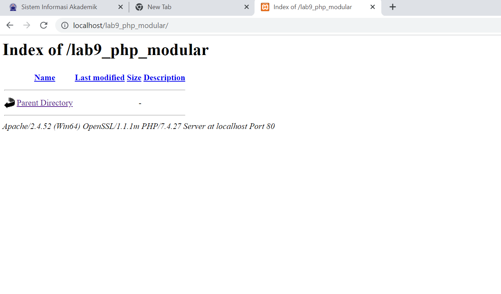

# Lab9Web
# Praktikum 9 PHP Modular

Langkah0langkah praktikum
1. Buka Vscode
2. Membuat folder baru dengan nama lab9_php_modular disimpan di docroot webserver (htdocs)

3. Buka xampp , start Apache dan MySQL
4. Buat file baru dengan nama header.php
berikut tampilan header.php

5. Buat file baru dengan nama footer.php
berikut tampilan footer.php

6. Buat file baru dengan nama home.php
berikut tampilan home.php

7. Buat file baru dengan nama about.php
berikut tampilan about.php

# Implementasi konsep modularisasi pada kode program praktikum 8
Tampilan konsep modularisasi pada kode program

berikut link repository praktikum 8 
https://github.com/marifatululfah5/Lab8Web.git